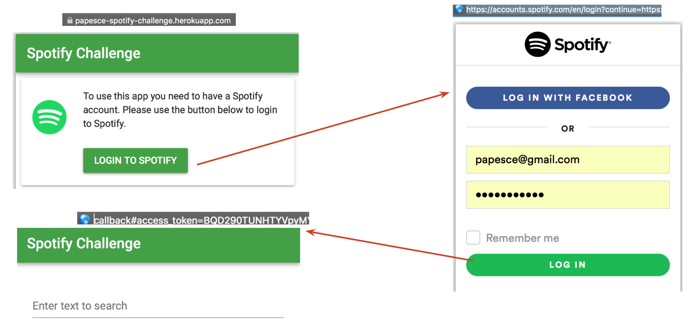
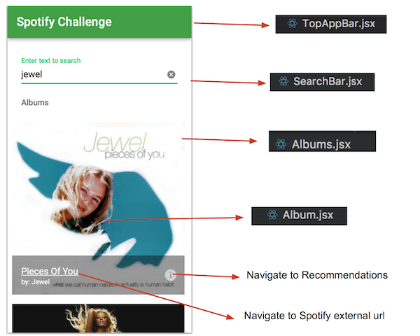
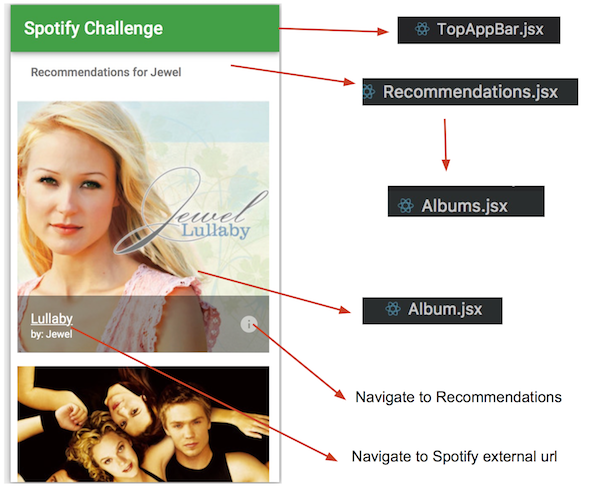

# spotify-challenge
Coding challenge

## Objective:
 Create a simple app that uses React and the Spotify API.

## Live Demo

You can test the latest demo here:

https://papesce-spotify-challenge.herokuapp.com/

## Screenshots

### Authentication Flow
To interact with the spotify API is required an authentication token.  To obtain this token is necessary to follow several steps.  The process is described in detail [here](https://developer.spotify.com/web-api/authorization-guide/)

To obtain the token I've used the React-Router capability



### Search API

The home page allow the user to search for albums. For each album there is an option to to search for recommendations based on the artist of the selected album. In this part the search API from spotify was used. Material-ui was used to speed up the implementation of each component. 




### Recommendations API

For each album the user can use the little button in the bottom right corner to search for recommendations based on the artist of the album.
This component was implemented reusing several components of the previous developed search components.



## Documentation 

Detailed documentation links will be available in this section

- [Documentation](docs/DOCUMENTATION.md) (in progess...)

## Installation

To install and run locally the app you should execute the following commands

```sh
git clone https://github.com/papesce/sp-challenge.git

cd sp-challenge/
git checkout dev
npm install

npm start
```
Open [http://localhost:3000](http://localhost:3000) to view it in the browser.


## Available Scripts

In the project directory, you can run:

#### `npm start`

Runs the app in the development mode. Open [http://localhost:3000](http://localhost:3000) to view it in the browser. The page will reload if you make edits. You will also see any lint errors in the console.

#### `npm run build`

Builds the app for production to the `build` folder. It correctly bundles React in production mode and optimizes the build for the best performance. The build is minified and the filenames include the hashes.<br>

This is the option used for automatic deployment to Heroku (see "heroku-postbuild" option in package.json)

#### `npm test`

Run the tests in the console.  The app uses [Jest](https://facebook.github.io/jest/) as its test runner. The tests are located next to the code they are testing so that relative imports appear shorter.

### License

sp-challenge app is [MIT licensed](./LICENSE).