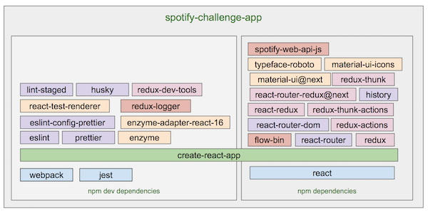

# Documentation

## Architecture

This project was bootstrapped with Create React App. On top of that, several npm packages were added. The following image describes the dependencies required to build and run the app.



[Here](NPM_DEPENDENCIES.md) I've documented all the commands required to build this app from scratch with a brief description of each package purpose.

### High level architecture

The basic idea is to have a clear separation between:

- State (handled by redux and stored in the redux folder)
- Spotify API interaction (handled in the spotify-api folder)
- Routing (handled in the router folder)
- Presenational Components (components that render UI using *material-ui*)
- Composite Components (Components that render UI using other components)
- Container Components. (Components that interact with redux and provide state and actions to the inner components)


There is also a TemplatePage component used to have consistency between
al the pages (same top bar)

Also and HOC Component (HomeContainer) provides generic support to handle authentication and token expiration for all the routes.

## Implementation Details

Following the [Thinking in React](https://reactjs.org/docs/thinking-in-react.html)  philosophy I've started with a mock with the vision of the final app. The following is a mock created with [wireframe.cc](https://wireframe.cc/pro/pp/c5cfe313a125568)


This is really helpfull to start thinking about the Components required, the Redux state shape, and the potential UI library that can be used to speedup development.

Finally 2 User Stories were created:

1. As a user I want to login to the app so I can interact with the Spotify API
2. As a user I want to search for albums so I can see all the albums related with an specific term

Later I've added a third User story:

3. As a user I want to see similar recommendations for one of the results so I can discover similar artists

### Routing

For the routing process a new library was used (react-router-redux). It provides integration between the three populars packages and provides a way to keep the routing history in the store.

 Four routes were developed:

- `/`&nbsp;&nbsp;&nbsp;    Used to render the HomePage
- `/login`   used to render de LoginContainer
- `/callback`   used to get the callback info. Handled in the LoginContainer
- `/recomendations/:albumid` used to render the Recommendations page base on the artist of the album (handled in the RecommHomePage)

The `HomePage` and `RecommHomePage` are wrapped with a HOC called HomeContainer that is a function that takes a Component and return a new Component adding the Authentication and Token Expiration check.

### Authentication to Spotify

To be able to interact with the Spotify API it is required to obtain a token. For that reason was neccesary to develop a UI that redirects to spotify url with a predefined CLIENT_ID.  If the user accepts the login then Spotify generates a redirection to the /callback route of the app.  This callback is handled in the LoginContainer. In this component the Redux action `loginSuccess` is dispatched setting the authentication info in the redux store.  A redirect to the `HomePage` completes the login cycle.

### Developing the UI with Material UI

There are plenty of alternatives to build the UI. I choose to use Material UI due to its popularity, the huge community of contributors and the modern style.
Material-ui has several  ready to use UI components for React. It is good to assure a consistent Theme across all the app.

Use the following link to visualize the main components with a [Storybook](https://papesce.github.io/storybook/).

## Redux model

THe redux store is based on three main reducers:

- Login reducer
- Search reducer
- Recommendations reducer

### Login Reducer

The dispatch of the LOGIN_SUCESS action will be intercepted by the login reducer. As a result the state will be updated with the users field containing the auth_token and expiration time.

### Search Reducer

The dispatch of the SEARCH  action will be intercepted by the thunk-reducer. Using the `redux-thunk-actions` npm package, three actions will be dispatched.  First a SEARCH_STARTED action will be dispatched. With this change of the state the UI can show the loading indicator. Then, the fetch to the spotify search API is dispatched. When a response from the server is received then the SEARCH_SUCCEEDED will be dispatched. In case of error the SEARCH_FAILED action will be dispatched.  This flow can be summarized in the following figure:


The state will contain a field called search with the result and the search term.

```state = { search: { searchText: "Jewel", result: {albums....}} }```

This state will be rendered with the `Albums` component.

### Calling the Recommendations API

This is implemented in the same way as the Search Reducer.  The Spotify API that is called is the `recommendations` API and the result it is stored in the recommendations field in the state.
